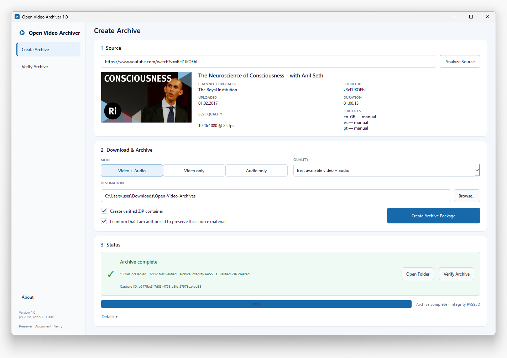

<p align="center">
  
</p>

<h1 align="center">Open Video Archiver</h1>

<p align="center">
  <strong>Preserve online video. Document the source. Verify the integrity.</strong><br>
  Built for journalism, research, OSINT and digital investigations.
</p>

<p align="center">
  <a href="https://github.com/j0hnhaas/open-video-archiver/releases/download/v1.0.0/Open-Video-Archiver-1.0-Windows-x64-Portable.zip"><strong>⬇ Download Windows portable (271.4 MB)</strong></a>
  &nbsp;·&nbsp;
  <a href="https://github.com/j0hnhaas/open-video-archiver/releases">All releases</a>
  &nbsp;·&nbsp;
  <a href="#install-from-source">Install from source</a>
</p>

<p align="center">
  <strong>Portable · No installer · No Python required on the target computer</strong>
</p>

---

**Open Video Archiver** creates documented, integrity-checked preservation packages from online video sources that the user is authorized to preserve.

A normal downloader answers: *Can I save this video?*

Open Video Archiver is built around a different question:

> *Can I preserve this material in a way that remains understandable and verifiable later?*

## Windows portable

**Current release: Open Video Archiver 1.0**

- **Windows x64 portable ZIP:** 271.4 MB
- **Installation:** none — extract and run `OpenVideoArchiver.exe`
- **Runtime:** Python/Qt, FFmpeg/FFprobe and Deno are included
- **Integrity:** SHA-256 checksum file is provided
- **Malware analysis:** [VirusTotal report for this exact release artifact](https://www.virustotal.com/gui/file/0ef67529f64fc3ef0e7600d2dd0afde393e7f4e002e788e4047a16fc71c47008/detection)

**[⬇ Download Open Video Archiver 1.0 for Windows x64](https://github.com/j0hnhaas/open-video-archiver/releases/download/v1.0.0/Open-Video-Archiver-1.0-Windows-x64-Portable.zip)**

SHA-256:

`0ef67529f64fc3ef0e7600d2dd0afde393e7f4e002e788e4047a16fc71c47008`

The accompanying checksum file is available on the [v1.0.0 release page](https://github.com/j0hnhaas/open-video-archiver/releases/tag/v1.0.0).

VirusTotal results are provided as additional information and do not constitute a security certification or guarantee.

After downloading, extract the ZIP and start `OpenVideoArchiver.exe`.

No separate Python, FFmpeg or Deno installation is required on the target computer.

## Preserve · Document · Verify

**Preserve** — capture the selected video/audio material together with source metadata, description, thumbnail and available source subtitles.

**Document** — record source identity, acquisition context, Capture ID, software environment and completeness information.

**Verify** — generate SHA-256 integrity records, verify the archive immediately and optionally create a verified ZIP container.

```text
Online video URL
    ↓
source metadata + format inspection
    ↓
video/audio acquisition with resume
    ↓
best-effort source subtitles
    ↓
provenance + metadata record
    ↓
SHA-256 integrity manifest
    ↓
optional verified ZIP container
```

## What an archive can contain

- selected video/audio material
- source metadata (`.info.json`)
- source description
- source thumbnail
- `SOURCE.url`
- `METADATA.md`
- `SOFTWARE.md`
- source subtitles on a best-effort basis
- `SESSION.json`
- `MANIFEST.json`
- `SHA256SUMS.txt`
- optional verified ZIP container plus separate SHA-256 checksum

## Intended use

Open Video Archiver is designed for **journalists, researchers, OSINT investigators, fact-checkers, archivists, documentary teams and digital-investigation workflows** that need more than a downloaded media file.

Typical uses include preserving publicly relevant online video, documenting audiovisual sources used in investigations, maintaining reproducible research collections, capturing source metadata before content changes or disappears, and creating integrity-checked working copies for fact-checking.

## Source support

Open Video Archiver uses **yt-dlp** as its extraction and acquisition engine. Source support therefore follows the providers and extractors available in the installed yt-dlp version.

The archive model itself is provider-neutral. A capture records the provider/extractor, source ID, entered URL and canonical retrieval URL without binding the archive format to one platform.

Open Video Archiver intentionally focuses on **single online-video sources**. It is not a channel monitor, subscription manager or media-library application.

## Desktop application

The desktop workflow provides:

- source inspection before acquisition
- video + audio, video-only and audio-only modes
- quality selection from formats reported by the source
- archive destination selection
- explicit rights confirmation
- resume detection for incomplete acquisitions
- threaded acquisition with progress and safe cancellation
- optional verified ZIP creation
- independent verification of archive folders and ZIP containers

## Integrity and provenance

Every new capture receives a random UUID-based **Capture ID**. It identifies the acquisition session; it is not an authenticity claim or cryptographic proof of source authorship.

`MANIFEST.json` uses the versioned schema `ova-manifest/1.0` and records source identity, acquisition settings, completeness information and semantic file roles.

After retrieval, Open Video Archiver generates SHA-256 hashes for the archive contents and verifies them immediately. If ZIP packaging is requested, the application additionally verifies ZIP readability, CRC and the expected member list before generating a separate SHA-256 checksum for the ZIP itself.

Existing archive directories and ZIP containers can later be re-verified with:

```powershell
ova verify "D:\Video-Archive\capture"
ova verify "D:\Video-Archive\capture.zip"
```

## Resume and fail-safe behavior

Downloads use partial files and resume support. If a run is interrupted, Open Video Archiver preserves partial data and `SESSION.json`.

When the same provider/source ID is encountered later, the application can resume an incomplete session rather than silently replacing it.

Automatic deletion never occurs after an error or interruption.

## Subtitles

Subtitles are **best-effort enrichment**, not a gate for the core archive.

The application first completes the media acquisition and then attempts to preserve manually supplied source subtitle tracks and an original-language automatic caption track when it can be identified reliably.

Automatically translated variants are deliberately excluded from the main workflow.

## Responsible use

Open Video Archiver requires the user to confirm that they are authorized to download and archive the selected material. The declaration is recorded but is not independently assessed.

Users remain responsible for copyright, contractual restrictions, privacy, data protection, source protection and any other applicable rules.

**Open Video Archiver is not a legal-admissibility or authenticity certification system.** It documents acquisition provenance and archive integrity; it does not independently prove authorship, source authenticity, truthfulness of content or admissibility as evidence.

## Install from source

Requirements:

- Python 3.10+
- FFmpeg available in `PATH`
- Deno 2.3+ available in `PATH`
- Internet access

Clone the repository and open PowerShell in the project directory:

```powershell
git clone https://github.com/j0hnhaas/open-video-archiver.git
cd open-video-archiver
```

Create and activate a virtual environment:

```powershell
python -m venv .venv
.\.venv\Scripts\Activate.ps1
```

Install Open Video Archiver:

```powershell
python -m pip install -e ".[gui]"
```

Start the desktop application:

```powershell
ova-gui
```

Or use the command-line interface:

```powershell
ova
ova "<VIDEO_URL>"
ova "<VIDEO_URL>" -o "D:\Video-Archive"
```

Press **Ctrl+C** at any time to cancel safely. Partial downloads are preserved for resume.

## Build the Windows portable release

On a Windows development machine with FFmpeg/FFprobe and Deno available:

```powershell
python -m pip install -e ".[gui,build]"
.\build-windows.ps1
```

The build creates:

```text
dist\Open-Video-Archiver-1.0-Windows-x64-Portable\
dist\Open-Video-Archiver-1.0-Windows-x64-Portable.zip
dist\Open-Video-Archiver-1.0-Windows-x64-Portable.zip.sha256
```

The portable folder contains `OpenVideoArchiver.exe`, the Python/Qt runtime, FFmpeg/FFprobe, Deno, the MIT license and software-provenance documentation.

## Privacy-safe provenance

Generated archive records avoid unnecessary local identifiers. Open Video Archiver does not intentionally retain private absolute archive paths, credentials, cookies or authentication tokens in the manifest.

Because the entered source URL itself is preserved, users should not supply secret-bearing URLs unless they intentionally want that URL recorded.

## Software provenance

Every archive receives a `SOFTWARE.md` recording the software actually used, including Python, yt-dlp, yt-dlp-ejs, Deno, curl_cffi and FFmpeg.

See also [ARCHITECTURE.md](ARCHITECTURE.md) for the internal design and [SOFTWARE.md](SOFTWARE.md) for component and license information.

## License

Open Video Archiver is released under the **MIT License**.

Copyright (c) 2026 John G. Haas.

See [LICENSE](LICENSE).

## Author

**John G. Haas**

Source: https://github.com/j0hnhaas/open-video-archiver
